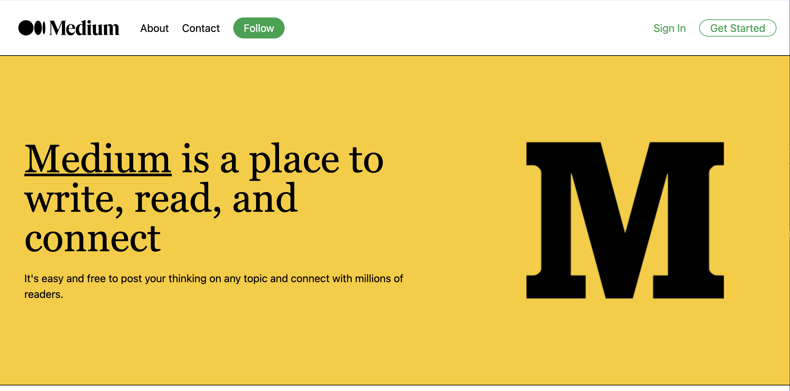
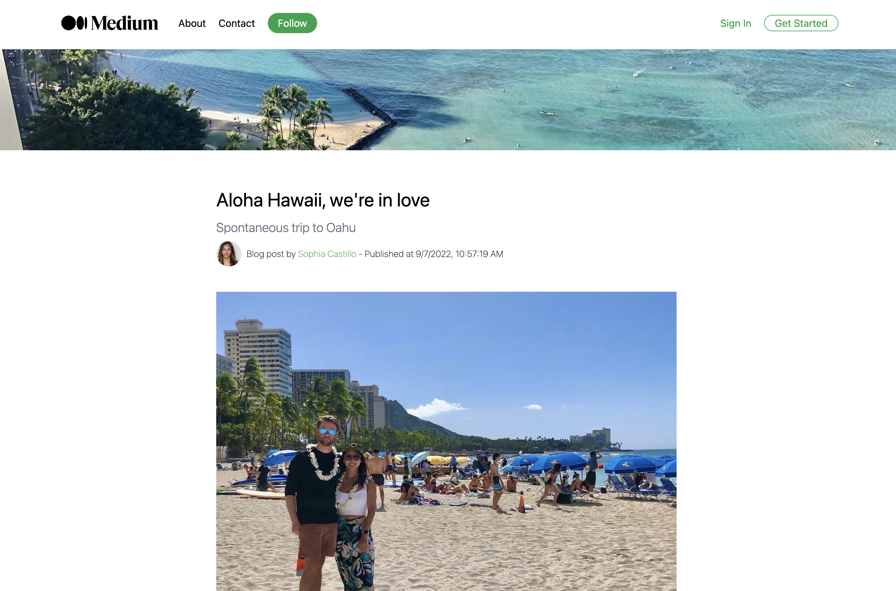
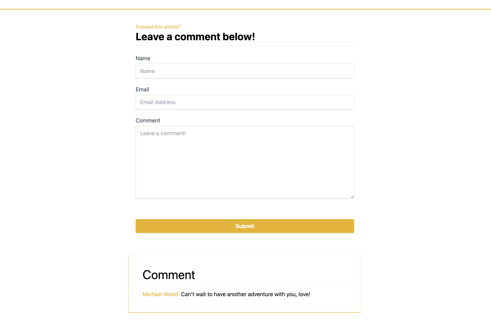

# Medium 2.0

## Description

This is a blog with travel content that can be maintained with ease. Form validation is in use. Users have the ability to leave comments and the client has the power to approve comments. 

We are using Sanity CMS to manage the backend. The data is fetched from Sanity and displayed on the frontend. The frontend is built with Next.js and Tailwind CSS. The frontend is deployed on Vercel. Fully responsive, built with incremental static regeneration. This static page is being dynamically updated every 60 seconds.

## Requirements

NPM, ReactJS, Next.JS, Tailwind CSS, TypeScript, react-portable-text, react-hook-form, Sanity, @sanity/client

## Technologies & Methods Used

React, NextJS, TypeScript, Tailwind CSS, ISR, & Sanity CMS

## Github Repository

https://github.com/sphcastillo/medium2.0

## Deployed Sites

Frontend:

https://medium2-0-hazel.vercel.app/

Backend:

https://sanitybackmediumfront.sanity.studio/

## More info

Author: Sophia Castillo,

Email: Sphcastillo@gmail.com,

Professional website: www.builtbysophia.com,

GitHub: https://github.com/sphcastillo,

LinkedIn: https://www.linkedin.com/in/sophia-castillo-b89124133/

